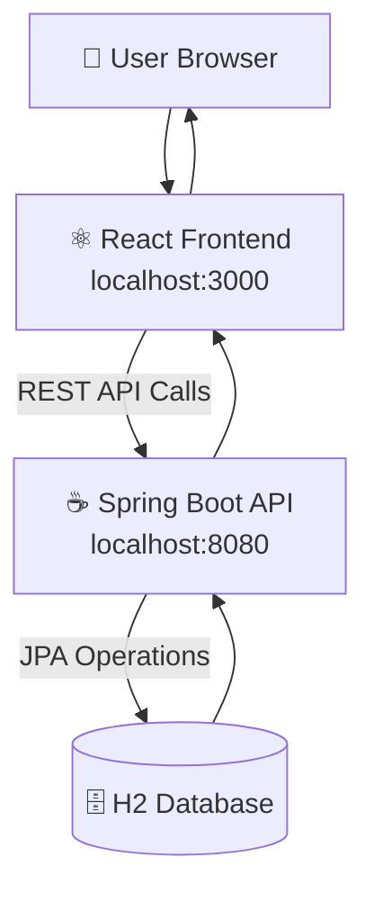
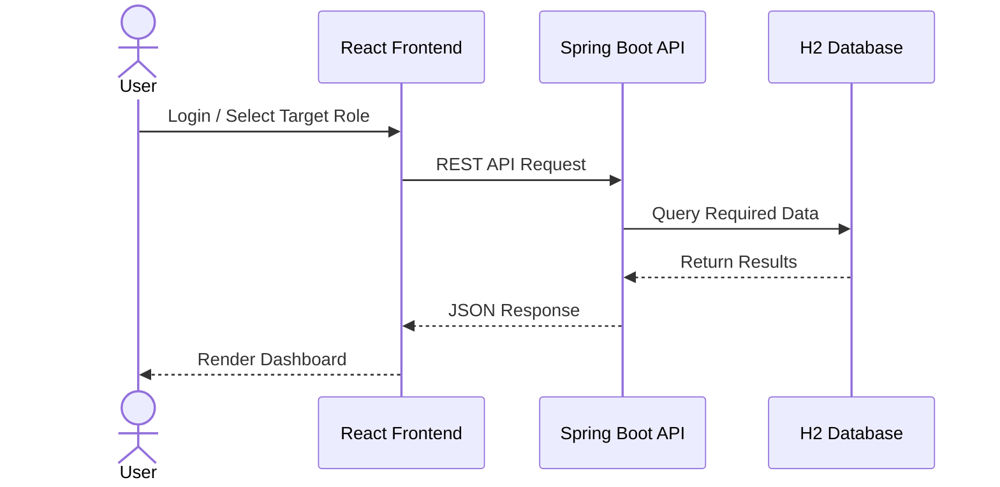
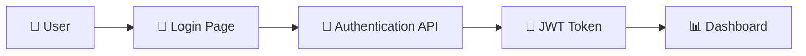
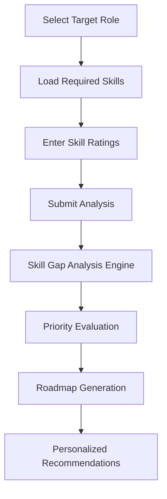

# 🚀 Phase 1: Traditional Deployment

## Overview

The initial version of SkillOrbit was deployed using a traditional application architecture where all components ran directly on the host machine without containerization.

This approach was chosen to rapidly validate business requirements, establish the full-stack architecture, and verify the end-to-end functionality of the platform before introducing Docker, cloud services, and orchestration technologies.

---

## Objectives

The goals of this deployment phase were to:

- Build the initial Minimum Viable Product (MVP)
- Establish frontend-to-backend communication
- Implement JWT-based authentication
- Introduce Role-Based Access Control (RBAC)
- Develop the Skill Gap Analysis Engine
- Validate roadmap generation capabilities
- Create a solid foundation for future deployment models

---

## Architecture



---

## Application Flow



---

## Technology Stack

### Frontend

- React.js
- JavaScript
- HTML5
- CSS3

### Backend

- Spring Boot
- Spring Security
- Spring Data JPA
- JWT Authentication

### Database

- H2 In-Memory Database

### Development Tools

- Maven
- Node.js
- npm
- Git

---

## Local Environment Setup

### Backend

Navigate to the backend project:

```bash
cd user-service
```

Build the application:

```bash
mvn clean install
```

Start the application:

```bash
mvn spring-boot:run
```

---

### Frontend

Navigate to the frontend project:

```bash
cd skillorbit-ui
```

Install dependencies:

```bash
npm install
```

Run the application:

```bash
npm start
```

---

## Access URLs

| Component | URL |
|------------|-----|
| Frontend | http://localhost:3000 |
| Backend | http://localhost:8080 |
| H2 Console | http://localhost:8080/h2-console |

---

## Authentication Flow



---

## Skill Analysis Workflow



---

## Challenges Encountered

### JWT Security Integration

**Challenge**

Implementing secure API authentication while maintaining a smooth user experience.

**Resolution**

- Integrated Spring Security
- Implemented JWT token generation and validation
- Added role-based authorization

---

### Frontend–Backend Communication

**Challenge**

Ensuring reliable communication between React and Spring Boot.

**Resolution**

- Standardized REST APIs
- Improved request and response handling
- Implemented centralized API communication patterns

---

### Data Model Design

**Challenge**

Maintaining relationships between Roles, Skills, Users, and Learning Roadmaps.

**Resolution**

- Designed normalized entity relationships
- Implemented JPA mappings
- Established clear ownership and associations

---

## Key Learnings

During this phase, the following concepts were successfully implemented and validated:

- Full-Stack Application Development
- React State Management
- REST API Design
- JWT Authentication
- Spring Security
- Role-Based Access Control
- Database Relationships using JPA
- Skill Gap Analysis Logic
- Learning Roadmap Generation

---

## Outcomes

✅ Successful MVP delivery

✅ Secure authentication and authorization

✅ Dynamic administration capabilities

✅ Interactive user dashboard

✅ Skill Gap Analysis Engine

✅ Learning Roadmap Generation

✅ Foundation established for future deployment strategies

---

## Deployment Evolution

The SkillOrbit platform evolved through multiple deployment strategies:

- ✅ Phase 1: Traditional Deployment
- 🚀 Phase 2: Containerized Deployment
- ☁️ Phase 3: Cloud Deployment
- ☸️ Phase 4: Orchestrated Cloud Deployment

---

## Next Phase

Continue to:

➡️ **[Phase 2: Containerized Deployment](02-containerized-deployment.md)**

Learn how SkillOrbit was transformed into a multi-container application using Docker, PostgreSQL, and Docker Compose.
